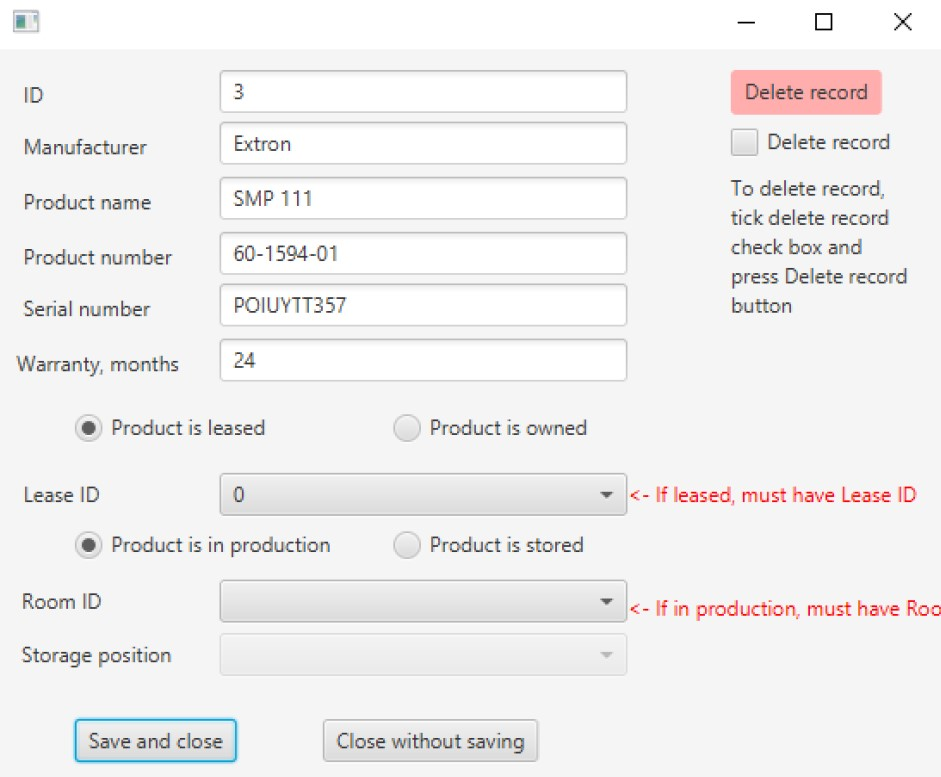

## WarehouseApplication

An application for two course assignments. Relational database for Data Management Systems course and JavaFX UI for User Interface Programmin course.

Code: Java, JavaFX FXML, SQL  
Database: MariaDB

Stores information about serialized products positions (warehouse position / where is installed and used) and bulk product quantities in warehouse.

  
_image 1: In main view there is 'serialized products' tab and 'add new serialized product' tab. Using search or clicking 'list all products' will list results to box below. Selecting item from list and clicking 'edit selected' will open edit view._  
  
_image 2: In edit view information fetched from database is shown and can be edited. If product is leased it has to have a lease id and if product is in production it has to have a room id._

### Project status

At this moment program is not working. I'm advancing my studies and this is on hold. When I get around to work with this project first thing is to make the intallations process so that program writes information to a settings file. Creating database should only once use admin credentials and make a database and a user account to MariaDB with enough privileges to operate the newly created database. In a small setting there could be some data warehouse for deleted record that user level account cannot manipulate.
